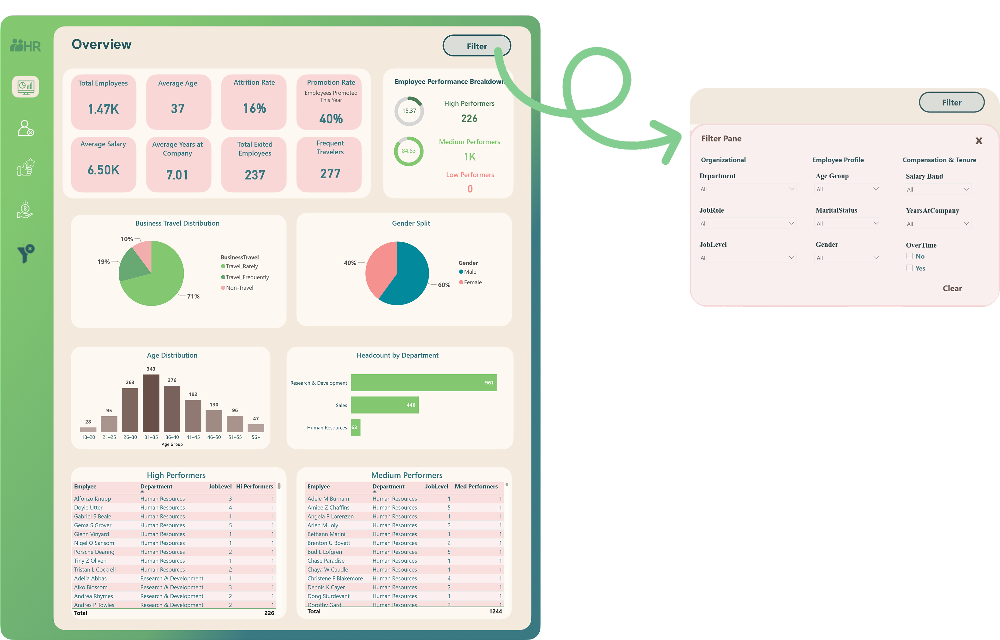
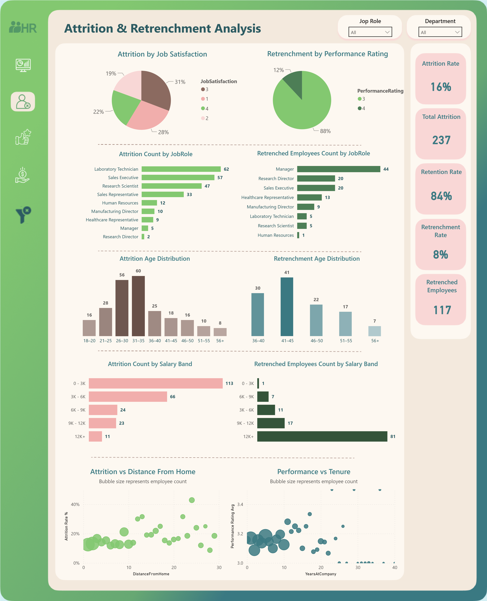
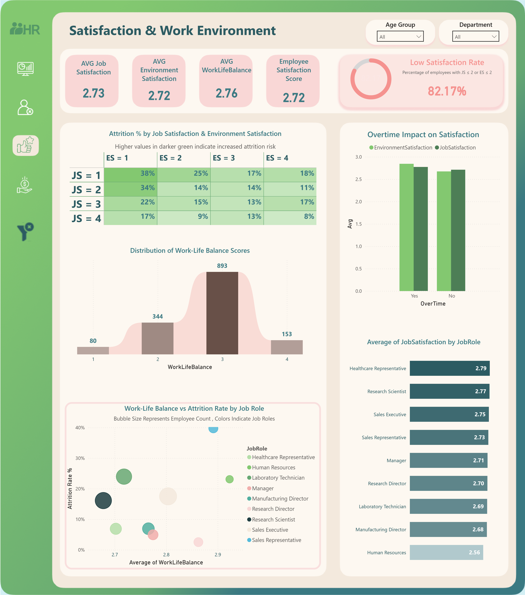
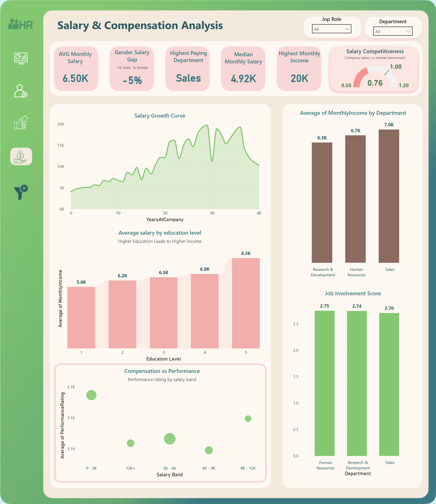

# HR Employee Insights – Detailed Report & Analysis

This document provides a comprehensive, page-by-page analysis of the HR Employee Insights Dashboard.  
Each section begins with the corresponding dashboard screenshot for visual context, followed by a narrative explanation of the insights.

---

# 1️⃣ Overview Page – Workforce Snapshot

The Overview page provides a holistic look at the organization’s workforce.  
According to Overview page, the company employs **1.47K individuals**, with an average age of **37**, indicating a balanced mix of junior and mid-career employees.

The age distribution reveals that the largest employee segment falls between **31–35 years**, followed closely by **26–30** and **36–40**, reflecting an experienced workforce with strong operational capacity.

The **Attrition Rate is 16%**, which equates to **237 total exits**. This is notable when paired with an average tenure of **7 years**, suggesting that certain groups are leaving earlier than expected while others are long-term contributors.

Promotion activity is strong: **40% of employees were promoted**, a positive sign of career mobility.

From a departmental view:
- **Research & Development** dominates with **961 employees**,  
- **Sales** follows with **446**,  
- **Human Resources** remains small at **63**, potentially stretched in resources.

The **Gender Split** (60% male, 40% female) suggests room for gender diversity initiatives in certain functions.

Performance distribution is skewed toward achievement:  
- **High Performers:** 226  
- **Medium Performers:** 1,244  
- **Low Performers:** 0  

This unusual absence of low performers may be due to rating calibration or performance evaluation timing.

Overall, the Overview page highlights strong organizational growth, experienced workforce composition, and several indicators requiring deeper inspection—particularly around turnover and satisfaction.

---

# 2️⃣ Attrition & Retrenchment Analysis

The Attrition & Retrenchment page provides deep insight into employee exits and organizational risk.

With an attrition rate of **16%**, totaling **237 departures**, the company is facing turnover concentrated in specific job roles:

- **Laboratory Technicians (62 exits)**  
- **Sales Executives (57 exits)**  
- **Research Scientists (47 exits)**  

These functions are essential to product development and revenue, making attrition here strategically concerning.

Attrition is most pronounced within younger age brackets, especially **26–30** and **31–35**, suggesting that early- to mid-career employees are more mobile or dissatisfied.

Salary band analysis reveals a strong link between compensation and retention:
- The **0–3K band accounts for 113 attrition cases**, nearly half of all turnover.  
This strongly indicates that **low compensation is the biggest attrition driver**.

Retrenchment, on the other hand, tells a different story.  
Of the **117 retrenched employees**, the highest counts belong to:

- **Managers (44)**  
- **Research Directors (20)**  
- **Sales Executives (20)**  

Retrenchment is clearly role- and seniority-driven, unlike voluntary attrition which is salary- and satisfaction-driven.

Performance rating plays a central role in retrenchment:
- **88% of retrenched employees had rating = 3**,  
indicating decisions are rooted in performance restructuring.

Scatterplot analysis suggests:
- Employees living farther from work tend to show slightly higher attrition risk.
- Performance stabilizes with increased tenure, meaning strong employees stay longer.

In summary, attrition results from dissatisfaction and salary issues, while retrenchment is strategic and performance-based.

---

# 3️⃣ Satisfaction & Work Environment

This page uncovers one of the most critical workforce challenges: **low employee satisfaction**.

The Employee Satisfaction Score is **2.72**, and a concerning **82.17% of employees fall into low satisfaction categories** (Job Satisfaction ≤ 2 or Environment Satisfaction ≤ 2).

Role analysis shows:
- Highest satisfaction among **Healthcare Representatives** and **Research Scientists**.  
- Lowest satisfaction among **Human Resources** and **Manufacturing Directors** — which is especially alarming since HR dissatisfaction affects support systems and employee wellbeing.

Attrition risk rises sharply for employees experiencing low satisfaction in both job and environment categories.  
For example:
- Employees with **JS = 1 and ES = 1** show attrition rates up to **38%**.

Work-life balance distribution highlights that most employees are rated at level **3** (893 individuals), but attrition varies heavily by job role.

**Overtime significantly reduces satisfaction**, Contrary to common expectations, employees who work overtime report marginally higher job and environment satisfaction compared to those who do not. This may indicate that overtime is performed by employees who are more engaged, more committed, or hold roles they enjoy, rather than experiencing overload.

Job role scatterplot shows that even roles with similar work-life balance scores experience different attrition levels, emphasizing that role demands—not just balance—shape retention risk.

This page suggests systemic issues in workload management, environment quality, and job satisfaction that may be feeding into attrition trends identified earlier.

---

# 4️⃣ Salary & Compensation Analysis

The Salary & Compensation page presents a detailed view of pay structures and earning dynamics.

- **Average Monthly Salary:** 6.50K  
- **Median Salary:** 4.92K  
This gap indicates a right-skewed distribution driven by higher earners.

The **Sales department is the highest-paying**, followed by Human Resources and R&D.

The **Gender Salary Gap is –5%**, meaning women slightly out-earn men an uncommon but positive equity marker.

**Salary Competitiveness = 0.76**, indicating the company may pay below the market rate in several roles, likely affecting attrition in lower salary bands.

The Salary Growth Curve shows strong progression up to **20–25 years**, then fluctuates possibly due to salary cap effects or uneven raise cycles.

Education level strongly impacts pay:
- Level 5 education corresponds to **8.3K**,  
- Level 1 education correlates with **5.6K**.

Despite expectations that higher performance should correlate with higher compensation, the data shows no clear alignment between salary and performance. Employees in lower salary bands demonstrate equal or even higher performance compared to those earning more.

Such misalignment can reduce motivation among strong performers and may be a key driver behind the elevated attrition rates identified in earlier pages of the dashboard.
---

# 5️⃣ Final Consolidated Summary

Across all four dashboard pages, the story that emerges is consistent and interconnected:

- The organization has a strong, experienced workforce with healthy promotion activity.  
- **Attrition is concentrated among younger, lower-paid employees**, underscoring salary competitiveness issues and early-career dissatisfaction.  
- **Retrenchment is performance-driven**, not demographic-driven.  
- **Satisfaction levels are critically low**, and strongly associated with attrition risk.  
- **Overtime and job environment issues** contribute meaningfully to dissatisfaction.  
- **Compensation lags behind market expectations**, especially in lower bands.  
- Education and tenure contribute positively to salary growth, supporting long-term retention for mid-career workers.

**In summary:**  
The organization possesses solid strengths in workforce experience, performance, and career mobility—but faces serious challenges in satisfaction, compensation competitiveness, and retention among key operational roles.  
To improve long-term stability, HR efforts should prioritize:

- Enhancing compensation fairness  
- Addressing work environment concerns  
- Reducing workload and overtime pressures  
- Supporting early-career development  
- Implementing role-specific retention strategies  

Together, these actions would significantly strengthen employee experience and organizational performance.

